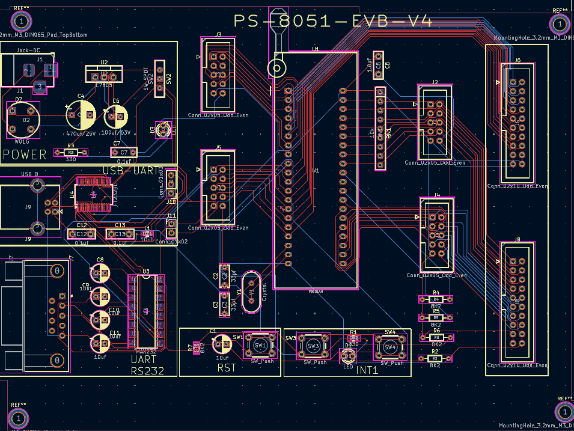

# PS-8051-EVB  
**8051 Microcontroller Evaluation Board**

## 📌 Project Overview
PS-8051-EVB is a custom-designed **8051 microcontroller evaluation board** developed for embedded systems learning and prototyping. The board integrates a regulated 5V power supply, USB-to-UART communication using FT232RL, crystal oscillator, reset circuitry, and multiple 2.54 mm IDC connectors for external interfacing.

## ⚙️ Key Features
- 8051 microcontroller (40-pin DIP / ZIF socket compatible)
- Onboard 5V regulated power supply (L7805)
- USB-to-UART interface using FT232RL
- External crystal oscillator circuit
- Reset circuitry for reliable startup
- 2.54 mm IDC headers for I/O expansion
- Mounting holes for enclosure fitting

## 🛠 Tools Used
- KiCad EDA (Schematic & PCB Layout)

## 📐 Design Files
- Complete KiCad schematic and PCB layout
- Manufacturing-ready Gerber files
- Project images and documentation

## 🖼 Schematic

## 🧩 PCB Layout

## 🔷 PCB 3D View

## 📂 Repository Structure
PS-8051-EVB/
├─ kicad/
├─ images/
├─ gerber/
├─ bom/
└─ README.md

## 🎯 Applications
- Embedded systems learning
- 8051 microcontroller experiments
- USB-based serial communication projects
- Academic and training use

## 👤 Author
**Prajyot Daphal**  
ENTC Engineering Student

---
